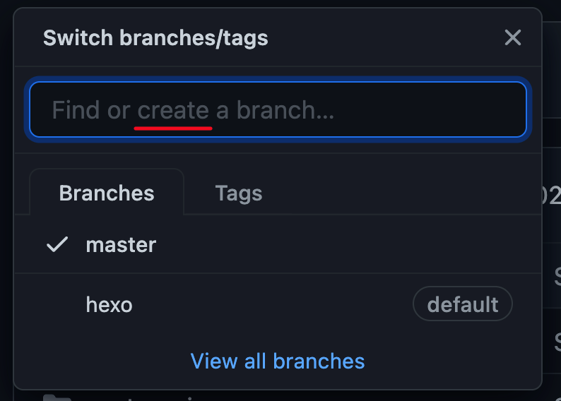
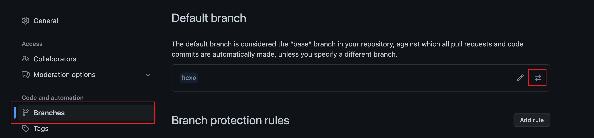

# 通过git branch实现多终端同步更新hexo博客


### 缘由：

​	原来一直用Windows的本子来搭建hexo博客，前段时间添加了一台Mac设备。通过将原来Windows本子上面的hexo工程嫁接到Mac设备上，大致理解了一些git的工作方式，这次突发奇想，想要两台设备都能更新，但是由于hexo的机制问题不能直接推拉，于是有了下面一系列的操作。

### hexo的机制：

​	hexo的机制为通过hexo d来向远端仓库推送本地编译后的文件，只是生成了网页文件，换句话说就是并没有把全部源文件上传上去。想要实现多终端同步更新就得通过整个源文件的推拉来进行，所以我们可以利用分支来储存源文件。

### 创建分支并上传源文件（原电脑上操作）：

1. ##### 创建分支

   首先在github上新建一个分支（这里我新建了一个叫做hexo的分支），如图：

   

   为了不用每次都指定分支，我们把新建的hexo分支设置成默认分支。

   

2. ##### 克隆到本地

   ​	利用终端克隆到本地：

   ```
   git clone git@github.com:JonWong959/JonWong959.github.io.git
   ```

   ​	(注意这里要修改成**自己的**仓库ssh地址)

3. ##### 源文件整理

   ​	把clone下来的

   ```
   JonWong959.github.io
   ```

   ​	文件夹里面**.git文件夹**之外的文件全部删除，然后把**原来博客的源文件**（**.deploy_git**不要）全部复制进来，注意不要漏掉**.gitignore**，如名字所示用来忽略到一些不必要上传的文件。**注意：如果用了主题，且主题里有.git文件需要删除掉，因为git不能嵌套上传，会报错。**

4. ##### 更新分支

   最后是提交更新：

   ```
   git add .
   git commit -m "hexo"
   git push
   ```

   ​	这样子分支就提交完毕了。

### 另外一台电脑上的操作：

​	由于我两台电脑都搭建好了环境，所以我在这里就不赘述hexo的搭建了，具体可以看官方的操作手册。

​	接下来跟刚刚一样把分支给clone下来，然后进入**clone下来的文件夹**操作，也就是说得进入JonWong959.github.io文件夹进行下面的操作：

```
npm install
npm install hexo-deployer-git --save
```

然后就可以正常写博客进行生成和推送操作了。


## 需要注意的地方：

1.每次在任意一台电脑操作完记得更新下分支：

```
git add .
git commit -m "hexo"
git push
```

2.换到另一台电脑操作时候需要把远端仓库源码拉取到本地，更新本地文件再操作：

```
git pull
```

3.源码所在分支设置建议为私有。

# 一句话总结：

## hexo d推送静态网页到master分支供别人访问，git push推送整个博客的源代码到分支进行备份，方便在不同端进行同步。
